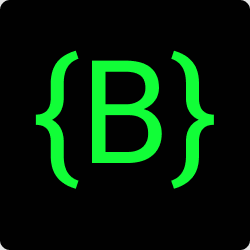

# Bracket

[](https://gitter.im/bracketcli/Lobby?utm_source=badge&utm_medium=badge&utm_campaign=pr-badge&utm_content=badge)
[](https://travis-ci.org/talonbragg/bracket)



A modern CLI for the modern world
**(Early Release, May have bugs.)**

## Table of Contents
- <a href="#about">About</a>
- <a href="#usage">Usage</a>
- <a href="#docs">Docs</a>
- <a href="#feat">Features</a>
- <a href="#cont">Contribute</a>
- <a href="#l">License</a>

<a name="about"></a>
## About

BracketCLI is an easy to use Command Line Interface tool. It comes with Mr. Node already installed, making your day a lot easier!

<a name="usage"></a>
## Usage

insert usage here

<a name="docs"></a>
## Documentation

**Npm:** 

```shell

npm install bracketcli

```

**Bower:** 

```shell

Coming Soon!

```

<a name="feat"></a>
## Features

**Creating Directories:** 

```shell

$ bracket -i, --init [directory]

```

<a name="cont"></a>
## Contribute

**Clone with Git:** 

```shell

$ git clone https://github.com/talonbragg/bracket

```

<a name="l"></a>
## License and Copyright

Licensed under the MIT License

:copyright: **Shreyas Lad and Talon Bragg 2017**

